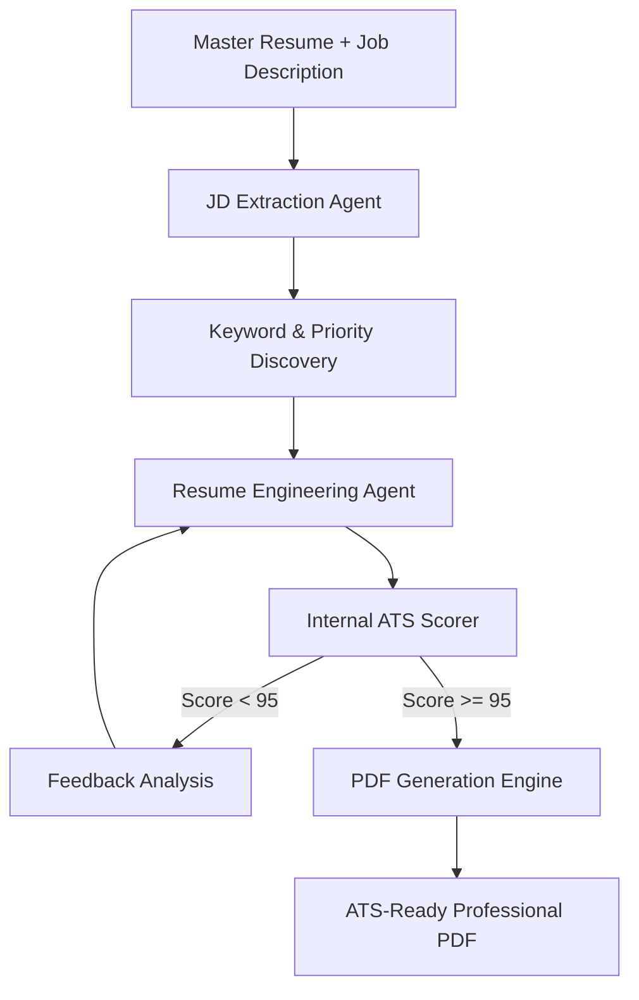

# 🚀 TailoredResume.ai: Next-Gen Agentic Resume Engineering

[](https://www.python.org/)
[](https://fastapi.tiangolo.com/)
[](https://ai.google.dev/)
[]()
[]()

**TailoredResume.ai** is not just a resume builder; it is a sophisticated **Agentic Pipeline** designed to defeat modern Application Tracking Systems (ATS). By leveraging the Google Gemini LLM, it engineers resumes through iterative refinement loops, ensuring 100% keyword coverage, perfect verb diversity, and mandatory metric quantification.

---

## 🌪️ The Agentic Refinement Loop

Unlike standard generators, our system operates on a **Closed-Loop Validation System**:



---

## ✨ Core Engineering Principles

Our "Governance Prompting" enforces strict rules to ensure your resume stands out:

### 1. Two-Tier Honesty Governance
- **Tier 1 (Strict):** Experience and Projects must remain 100% grounded in master data. No fabrications.
- **Tier 2 (Flexible):** The Skills and Summary sections act as "Keyword Absorption Layers," mapping academic exposure to JD requirements to maximize ATS visibility.

### 2. Quantification Engine
Automatically re-interprets vague bullet points into data-backed metrics.
- *Before:* "Improved pipeline performance."
- *After:* "Optimized inference throughput by **38% across 1.2M rows** using parallel Dask processing."

### 3. Linguistic Diversity (Zero-Verb-Repetition)
Mandates that every single action verb used in the resume is unique. No more "Developed this, Developed that." The engine draws from a high-impact architectural vocabulary (e.g., *Orchestrated*, *Synthesized*, *Calibrated*).

---

## 🛠️ Key Platform Features

- [x] **Agentic Analysis:** Deep job description parsing for intent extraction.
- [x] **Precision Scriptorium:** High-fidelity rewriting of resume bullets.
- [x] **ATS Scorer:** Internal validator for keyword and impact metrics.
- [x] **JSON-to-PDF:** Instant conversion from data structure to professional document.
- [x] **Mobile Warning:** Desktop-optimized UX with responsive safety nets.
- [x] **SEO Ready:** Complete metadata, sitemaps, and robots configuration.

---

## 🎨 Design System & Aesthetics

TailoredResume.ai is built with a bespoke design system titled **"The Precision Scriptorium"**:
- **Typography:** Inter for clarity, Newsreader for editorial authority.
- **Palette:** Ivory Vellum (`#faf9f7`) and Authoritative Amber (`#d97706`).
- **Surface Geometry:** Minimalistic sharp radii (2px-4px) for a professional Swiss feel.
- **Micro-Animations:** Fluid, high-performance transitions for landing page interactions.

---


### 1. The Discovery Agent (`analyze_jd`)
The pipeline begins by "Interrogating" the Job Description. It doesn't just look for words; it looks for **intent**. 
- **Output:** A structured JSON containing `must_have_skills`, `industry_keywords`, and `top_3_priorities`.

### 2. The Synthesis Agent (`tailor_resume_attempt`)
Using **Governance Prompting**, this agent transforms the master data.
- **Strict Mode:** Ensures bullet points match the **20-25 word sweet spot** that ATS parsers love.
- **Quantification:** Enforces a "Show, Don't Tell" policy by requiring numeric metrics in every bullet.

### 3. The Critic Agent (`score_resume_internal`)
This acts as an internal gatekeeper, scoring the resume on:
- **Keyword Match (30%)**
- **Impact Density (30%)**
- **Verb Diversity (15%)**
- **Structural Integrity (25%)**

---

## 📡 API Reference

### `POST /api/tailor`
The primary endpoint for resume engineering.
- **Form Data:**
  - `master_json`: The user's complete profile.
  - `jd`: The target job description.
- **Response:**
  ```json
  {
    "success": true,
    "data": { ...tailored_json... },
    "score": 96.5,
    "metrics": { "keyword": 100, "quant": 92, ... }
  }
  ```

### `POST /api/download`
Converts and streams a JSON resume into a professional PDF.
- **Body:** `{ "resume_data": { ... } }`
- **Output:** Binary PDF Stream.

---

## 🛠️ Advanced Developer Setup

### Prerequisites
- Python 3.12 or higher.
- Google Cloud Project with Gemini API access.
- [ReportLab](https://www.reportlab.com/) for PDF rendering.

### Setting up the Logic Engine
```powershell
# 1. Initialize environment
python -m venv .venv
source .venv/bin/activate  # Or .venv\Scripts\activate on Windows

# 2. Install core Stack
pip install -r requirements.txt

# 3. Launch Development Server
uvicorn main:app --reload --port 8000
```

---

## 📜 License & Contribution
This project is open-source under the **MIT License**. Contributions to the Agentic Loop logic or the PDF rendering engine are welcome.

*Developed with Strategic Engineering for High-Growth Roles by **Nikhil Pitroda**.*